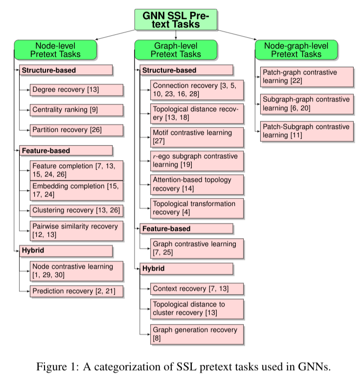

#  A collection of SSL pretext tasks used in GNNs
Categorization and summarization of the state-of-the-art Self-supervised Learning (SSL) on Graph Neural Networks (GNNs).

For more details, please refer to **our book chapter (link coming soon)**. If you find this useful and use it in your research, please temporarily cite our work as follows:

    @inproceedings{wang2021gnnssl,
     author = {Wang, Yu and Jin, Wei and Derr, Tyler},
     title = {Graph Neural Networks: Self-supervised Learning},
     year = {2021}
    }

# Contents
- __[Categorization](#Categorization)__
- __[Summarization](#Summarization)__
  - __[Node-level](#Node-level)__
    - [Node-structure-based](#Node-structure-based)
    - [Node-feature-based](#Node-feature-based)
    - [Node-hybrid](#Node-hybrid)
  - __[Graph-level](#Graph-level)__
    - [Graph-structure-based](#Graph-structure-based)
    - [Graph-feature-based](#Graph-feature-based)
    - [Graph-hybrid](#Graph-hybrid)
  - __[Node-graph-level](#Node-graph-level)__
- __[Application](#Application)__
- __[Reference](#Reference)__

# Categorization
Pretext tasks are constructed by leveraging different types of supervision information coming from different components of graphs. Based on the components that generate the supervision information, pretext tasks that are prevalent in the literature are categorized into node-level, graph-level and node-graph level. In completing node-level and graph-level pretext tasks, three types of information can be leveraged: graph structure, node features, or hybrid, where the latter combines the information from node features, graph structure, and even information from the known training labels. We summarize the categorization of pretext tasks as a tree where each leaf node represents a specific type of pretext tasks in the following figure while also including the corresponding [**references**](ssl_category_tree.pdf).

# Summarization
## Node-level
For node-level pretext tasks, methods have been developed to use easily-accessible data to generate pseudo labels for each node or relationships for each pair of nodes. In this way, the GNNs are then trained to be predictive of the generated pseudo labels or to keep the equivalence between the node embeddings and the original node relationships.

#### Node-structure-based
Different nodes have different structure properties in graph topology, which can be measured by the node degree, centrality, node partition, etc. Thus, for structure-based pretext tasks at the node-level, we expect to align node embeddings extracted from the GNNs with their structure properties, in an attempt to ensure this information is preserved while GNNs learn the node embeddings.

* [Self-supervised Learning on Graphs: Deep Insights and New Direction](https://arxiv.org/pdf/2006.10141.pdf) (Arxiv 2020) [[**Summary**]](summary/Wei_deep.pdf) [[**Code**]](https://github.com/ChandlerBang/SelfTask-GNN).
* [When Does Self-Supervision Help Graph Convolutional Networks?](https://arxiv.org/pdf/2006.09136.pdf) (ICML 2020) [[**Summary**]](summary/you_when.pdf) [[**Code**]](https://github.com/Shen-Lab/SS-GCNs).
* [Pre-Training Graph Neural Networks for Generic Structural Feature Extraction](https://arxiv.org/pdf/1905.13728.pdf) (ICLR 2019 workshop) [[**Summary**]](summary/genetic_graph_extraction.pdf).

#### Node-feature-based
Node features are another important information that can be leveraged to provide extra supervision.

* [Self-supervised Learning on Graphs: Deep Insights and New Direction](https://arxiv.org/pdf/2006.10141.pdf) (Arxiv 2020) [[**Summary**]](summary/Wei_deep.pdf) [[**Code**]](https://github.com/ChandlerBang/SelfTask-GNN).
* [When Does Self-Supervision Help Graph Convolutional Networks?](https://arxiv.org/pdf/2006.09136.pdf) (ICML 2020) [[**Summary**]](summary/you_when.pdf) [[**Code**]](https://github.com/Shen-Lab/SS-GCNs).
* [Graph-Based Neural Network Models with Multiple Self-Supervised Auxiliary Tasks](https://openreview.net/pdf?id=hnJSgY7p33a) (Openreview 2020) [[**Summary**]](summary/Multile_ss_auxiliary.pdf).
* [Strategies for Pre-training Graph Neural Networks](https://arxiv.org/pdf/1905.12265.pdf) (ICLR 2020) [[**Summary**]](summary/Jure_ssl.pdf) [[**Code**]](https://github.com/snap-stanford/pretrain-gnns/).

#### Node-hybrid
Instead of employing only the topology or only the feature information as the extra supervision, some pretext tasks combine them together as a hybrid supervision, or even utilize information from the known training labels.

* [Distance-wise Graph Contrastive Learning](https://arxiv.org/pdf/2012.07437.pdf) (Arxiv 2020) [[**Summary**]](summary/distance_wise.pdf).
* [Deep Graph Contrastive Representation Learning](https://arxiv.org/pdf/2006.04131.pdf) (Arxiv 2020) [[**Summary**]](summary/GRACE.pdf) [[**Code**]](https://github.com/CRIPAC-DIG/GRACE).
* [Graph Contrastive Learning with Adaptive Augmentation](https://arxiv.org/pdf/2010.14945.pdf) (WWW 2021) [[**Summary**]](summary/GRACE_adaptive.pdf)
* [Multi-Stage Self-Supervised Learning for Graph Convolutional Networks on Graphs with Few Labels](https://arxiv.org/pdf/1902.11038.pdf) (AAAI 2020) [[**Summary**]](summary/m3s.pdf).

## Graph-level
After having just presented the node-level SSL pretext tasks, in this section we focus on the graph-level SSL pretext tasks where we desire the node embeddings coming from the GNNs to encode information of graph-level properties.

#### Graph-structure-based
* [Self-supervised Training of Graph Convolutional Networks](https://arxiv.org/pdf/2006.02380.pdf) (Arxiv 2020) [[**Summary**]](summary/Qikui.pdf)
* [SLAPS: Self-Supervision Improves Structure Learning for Graph Neural Networks](https://openreview.net/pdf?id=a5KvtsZ14ev) (Openreview 2020) [[**Summary**]](summary/SLAPs.pdf).
* [Self-supervised Learning on Graphs: Deep Insights and New Direction](https://arxiv.org/pdf/2006.10141.pdf) (Arxiv 2020) [[**Summary**]](summary/Wei_deep.pdf) [[**Code**]](https://github.com/ChandlerBang/SelfTask-GNN).
* [Self-Supervised Graph Representation Learning via Global Context Prediction](https://arxiv.org/pdf/2003.01604.pdf) (Openreview 2020) [[**Summary**]](summary/global_context_prediction.pdf).
* [How to Find Your Friendly Neighborhood: Graph Attention Design with Self-Supervision](https://openreview.net/pdf?id=Wi5KUNlqWty) (ICLR 2021) [[**Summary**]](summary/friendly_neighborhood.pdf).
* [ Motif-Driven Contrastive Learning of Graph Representations](https://arxiv.org/pdf/2012.12533.pdf) (Openreview 2020) [[**Summary**]](summary/motif_driven.pdf).
* [ GCC: Graph Contrastive Coding for Graph Neural Network Pre-Training](https://arxiv.org/pdf/2006.09963.pdf) (KDD 2020) [[**Summary**]](summary/GCC.pdf) [[**Code**]](https://github.com/THUDM/GCC).
* [ TopoTER: Unsupervised Learning of Topology Transformation Equivariant Representations](https://openreview.net/pdf?id=9az9VKjOx00) (Openreview 2020) [[**Summary**]](summary/topoTER.pdf).

#### Graph-feature-based
Typically, graphs does not come with any feature information and here the graph-level features refer to the graph embeddings obtained after applying a pooling layer on all node embeddings from GNNs.

* [Strategies for Pre-training Graph Neural Networks](https://arxiv.org/pdf/1905.12265.pdf) (ICLR 2020) [[**Summary**]](summary/Jure_ssl.pdf) [[**Code**]](https://github.com/snap-stanford/pretrain-gnns/).

#### Graph-hybrid
* [Self-supervised Graph-level Representation Learning with Local and Global Structure](https://openreview.net/pdf?id=DAaaaqPv9-q) (Openreview 2020) [[**Summary**]](summary/local_global.pdf).
* [Self-supervised Learning on Graphs: Deep Insights and New Direction](https://arxiv.org/pdf/2006.10141.pdf) (Arxiv 2020) [[**Summary**]](summary/Wei_deep.pdf) [[**Code**]](https://github.com/ChandlerBang/SelfTask-GNN).
* [Strategies for Pre-training Graph Neural Networks](https://arxiv.org/pdf/1905.12265.pdf) (ICLR 2020) [[**Summary**]](summary/Jure_ssl.pdf) [[**Code**]](https://github.com/snap-stanford/pretrain-gnns/).
* [ GPT-GNN: Generative Pre-Training of Graph Neural Networks](https://arxiv.org/pdf/2006.15437.pdf) (KDD 2020) [[**Summary**]](summary/generative_pred.pdf) [[**Code**]](https://github.com/acbull/GPT-GNN).

### Node-graph-level
All the above pretext tasks are designed based on either the node or the graph level supervision. However, there is another final line of research combining these two sources of supervision to design pretext tasks, which we summarize in this section.

* [Deep Graph Informax](https://arxiv.org/pdf/1809.10341.pdf) (ICLR 2019) [[**Summary**]](summary/DGI.pdf) [[**Code**]](https://github.com/PetarV-/DGI).
* [Contrastive Multi-View Representation Learning on Graphs](https://arxiv.org/pdf/2006.05582.pdf) (ICML 2020) [[**Summary**]](summary/contrastive_multi_view.pdf) [[**Code**]](https://github.com/kavehhassani/mvgrl).

## Application and other work
* [COAD: Contrastive Pre-training with Adversarial Fine-tuning for Zero-shot Expert Linking](https://arxiv.org/pdf/2012.11336.pdf) (Arxiv 2020) [[**Summary**]](summary/coad.pdf).
* [Pre-Training Graph Neural Networks for Cold-Start Users and Items Representation](https://arxiv.org/pdf/2012.07064.pdf) (WSDM 2021) [[**Summary**]](summary/cold_user.pdf) [[**Code**]](https://github.com/jerryhao66/Pretrain-Recsys).
* [ Graph-based, Self-Supervised Program Repair from Diagnostic Feedback](https://arxiv.org/pdf/2005.10636.pdf) (ICML 2020) [[**Summary**]](summary/program_repair.pdf).
* [ Can Graph Neural Networks Go "Online"? An Analysis of Pretraining and Inference](https://arxiv.org/pdf/1905.06018.pdf) (ICLR 2019 workshop) [[**Summary**]](summary/online.pdf).

## Reference and Acknowledge
For an up to date list of SSL GNN papers please refer to [**awesome-self-supervised-gnn**](https://github.com/ChandlerBang/awesome-self-supervised-gnn).
